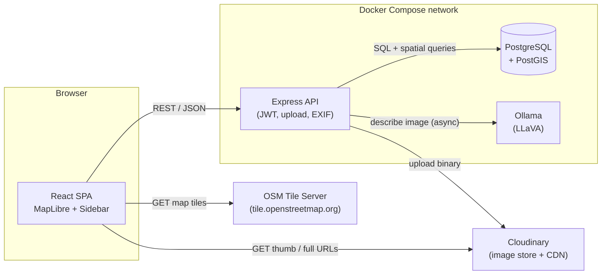
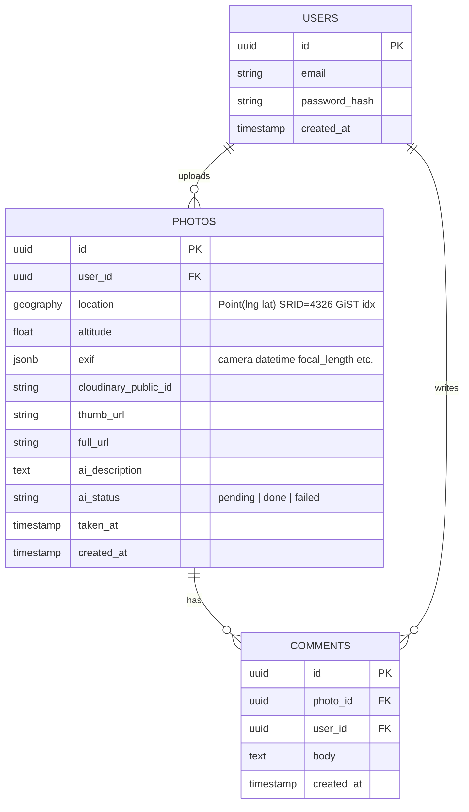
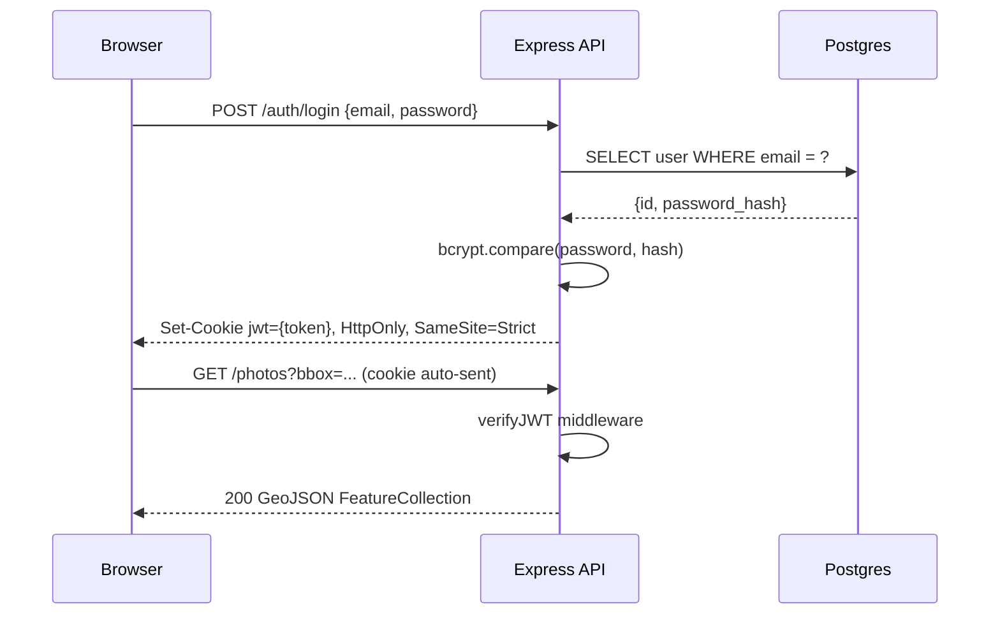
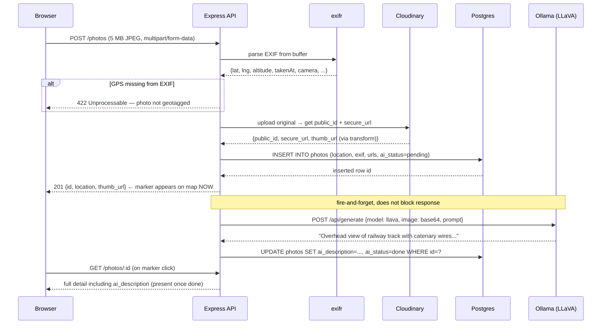
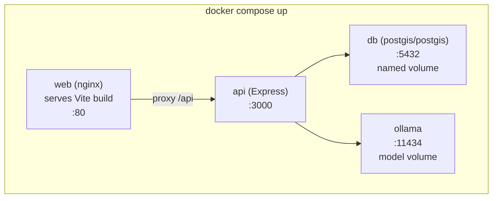
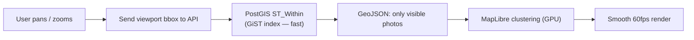

# HyLight — Geotagged Aerial Photo Mapping
## Architecture Document ("The Strategist")

**Author:** Rami Zarraa · **Date:** 2026-06-05 · **Version:** 0.1 (design)

---

## 1. Context & Goals

An internal ops tool for HyLight's airship inspection workflow. Operators upload high-resolution aerial JPEGs (~4–5 MB) of railway lines and energy infrastructure. Each photo carries EXIF GPS + altitude + camera metadata. The app must:

1. Authenticate users (sign up / log in).
2. Ingest geotagged photos, extract their location from EXIF.
3. Plot them as markers on an interactive map.
4. Let a user click a marker to view the image, read an **AI-generated description**, and add comments.

**Design priorities (per the brief):** clean conception and architecture over tooling; production-ready *thinking* even though the build target is a ~4h MVP. The aesthetic is ops/field tooling — dark, dense, map-first (70% map / 30% detail sidebar).

**Two horizons kept distinct throughout this doc:**
- **MVP (build target):** what ships in the ~4h test — single operator, dozens-to-hundreds of photos, Cloudinary free tier, Docker Compose local.
- **Production (design target):** 10k+ photos, ~40–50 GB, multiple operators. The MVP is designed so it doesn't paint us into a corner here.

---

## 2. Technology Choices per Layer

| Layer | Choice | Why it wins here | Alternatives (and why not now) |
|---|---|---|---|
| **Frontend** | React + TypeScript + Vite | Component model fits a map + reactive sidebar; TS catches EXIF/GeoJSON shape bugs early; Vite = instant HMR. | **Next.js** — SSR/routing unneeded for a single-screen internal SPA; adds weight. **Vue/Svelte** — fine, but React has the deepest MapLibre ecosystem. |
| **Styling** | TailwindCSS | Fast to hit a dense, dark ops aesthetic without a CSS-naming bikeshed; utility classes keep the map/sidebar layout tight. | **CSS Modules** — more boilerplate. **MUI** — too "generic SaaS", fights the field-tooling look. |
| **Map** | MapLibre GL JS + OSM tiles | Open-source (no token/usage billing), vector-capable, native GeoJSON sources + clustering — exactly what 10k markers need. OSM raster tiles (`tile.openstreetmap.org`) are free and require no API key. | **Leaflet** — simpler but raster-first, clustering is a plugin, weaker at scale. **Mapbox GL** — same API lineage but token-gated and metered. **Google Maps** — cost + closed. |
| **Backend** | Node.js + Express | Same language as frontend (one mental model), great `multipart` + streaming story for 5 MB uploads, mature EXIF/HTTP libs. | **Fastify** — faster, but Express's ubiquity wins for a test. **NestJS** — more structure than a 4h MVP needs. **Python/FastAPI** — strong, but splits the stack. |
| **Database** | PostgreSQL + PostGIS | One store for relational data *and* geospatial. `GEOGRAPHY(Point)` + GiST index makes "photos in this viewport" a single fast query — the core of map performance at scale. | **MongoDB + geo index** — works, but weaker spatial ops and joins. **SQLite/Spatialite** — no concurrency/scale path. **Plain Postgres + lat/lng floats** — loses spatial indexing; bbox queries get slow. |
| **Storage** | Cloudinary (free tier for MVP) | Offloads 5 MB binaries from our DB/API, gives on-the-fly resizing (thumbnails for markers, full-res on click) via URL transforms — huge for map perf. | **S3 / Cloudflare R2** — the *production* answer (see §7); no built-in transforms without a CDN/Lambda. **MinIO** — self-hosted S3 for full control. **DB bytea / local disk** — doesn't scale, bloats backups. |
| **Auth** | JWT (stateless, HTTP-only cookie) | Stateless fits a Dockerized API with no shared session store; cookie storage avoids XSS token theft vs. localStorage. | **Sessions + Redis** — adds an extra service for the MVP. **Auth0/Clerk** — overkill + external dependency for an internal tool. |
| **AI** | Ollama + LLaVA (self-hosted) | Zero cost, fully local (inspection imagery may be sensitive — no third-party data egress), vision model describes infrastructure photos well. | **GPT-4V / Claude vision** — better quality but per-call cost + sends proprietary imagery off-prem. **BLIP-2 self-hosted** — lighter but weaker captions. |
| **Deploy** | Docker Compose (local) | One `up` brings up the whole graph (web, api, db, ollama); reproducible, matches the brief. | **K8s** — massive overkill. **Bare-metal** — not reproducible. **Cloud PaaS** — out of scope. |

---

## 3. System Design

### 3.1 Service topology

The browser talks to our API for data, **directly to Cloudinary's CDN for image bytes**, and **directly to OSM for map tiles**. The API never proxies image pixels or tiles, keeping it light.

### 3.2 Data models

`location` is `GEOGRAPHY(Point, 4326)` with a GiST index — not two float columns. That index is what makes viewport queries cheap at 10k rows. `ai_description` is nullable with an `ai_status` enum so the UI can show "Generating…" while LLaVA runs; AI must never block the upload response.

### 3.3 API surface (MVP)

| Method | Route | Auth | Purpose |
|---|---|---|---|
| `POST` | `/api/auth/register` | — | Create user, hash password (bcrypt). |
| `POST` | `/api/auth/login` | — | Verify, set HTTP-only JWT cookie. |
| `POST` | `/api/auth/logout` | — | Clear cookie. |
| `POST` | `/api/photos` | JWT | Multipart upload → EXIF parse → Cloudinary → DB row → fire AI. |
| `GET` | `/api/photos?bbox=w,s,e,n` | JWT | Photos within map viewport, returned as GeoJSON FeatureCollection. |
| `GET` | `/api/photos/:id` | JWT | AI status + description (polled by sidebar while `pending`). |
| `GET` | `/api/photos/:id/comments` | JWT | List comments for a photo (id, body, email, created_at). |
| `POST` | `/api/photos/:id/comments` | JWT | Add a comment. |

`GET /api/photos` returns a **GeoJSON FeatureCollection** so MapLibre consumes it as a source directly with no client-side reshaping.

### 3.4 Auth flow

---

## 4. Data Flow — Upload to Map Display

The critical path. The upload HTTP response returns **fast**; AI description fills in asynchronously afterward.

**Why this ordering:**
- **EXIF validation before upload** — reject unmappable photos early (422) and never burn a Cloudinary slot on them.
- **Return before AI finishes** — LLaVA on CPU can take 10–60 seconds per image. Blocking the upload response on it would make the UI feel broken. The marker appears immediately; description fills in on the next fetch.
- **Browser fetches image bytes from Cloudinary directly** via transform URLs (e.g. `…/w_64,h_64,c_fill/photo_id.jpg`), keeping our API off the image-serving hot path.

For the MVP, "async" is a fire-and-forget call after responding. For production it becomes a proper job queue (§7).

---

## 5. Deployment

Single `docker-compose.yml`, four services on one bridge network:

**Key decisions:**
- `db` uses the official `postgis/postgis` image; an init SQL script runs once to enable the extension and create all tables.
- `ollama` pre-pulls `llava` into a named volume so restarts don't re-download the 4+ GB model.
- `api` has a `depends_on` healthcheck on `db` so it won't start before Postgres is ready.
- Secrets (JWT secret, Cloudinary API key/secret, DB password) come from `.env` via Compose `env_file`. `.env.example` is committed; `.env` is gitignored.
- The Vite build is baked into a `web` nginx image at build time (`RUN npm run build`), served as static files. Nginx also reverse-proxies `/api/*` to the Express container — no CORS config needed. **MVP note:** the current dev setup uses the Vite dev server directly on `:5173` with a proxy to the API; nginx is the production step.

**Production lift path:** the same Compose graph runs on a single VM. Swap Cloudinary for S3/R2, put nginx behind Certbot for TLS, and promote the AI fire-and-forget into a worker service with a queue (e.g. BullMQ + Redis) — the rest of the architecture is unchanged.

---

## 6. Storage & Performance Trade-offs at 10k+ Photos

### 6.1 The storage reality (flagged honestly)

10,000 photos × ~4–5 MB = **40–50 GB**. Cloudinary's free tier caps at ~25 GB and 25 monthly credits. **It cannot hold a full 10k dataset.** It is the right choice for the MVP and demo, but it is not the 10k-scale answer.

**Production migration path:**

| Concern | MVP (Cloudinary free) | Production |
|---|---|---|
| Object store | Cloudinary free (~25 GB) | **Cloudflare R2** (no egress fees, S3-compatible) or **MinIO** self-hosted. For AWS shops: S3 + CloudFront. |
| Thumbnails | Cloudinary URL transforms on-the-fly | Pre-generate at upload time with `sharp` (mozjpeg); store `thumb` (64 px) + `medium` (800 px) + `original` variants. |
| Originals | As uploaded (~4–5 MB) | Compress at ingest: `sharp` + mozjpeg brings 4–5 MB → ~1–1.5 MB with negligible quality loss for review use. 10k compressed ≈ 10–15 GB instead of 40–50 GB. |
| Cold storage | N/A | Older missions move to S3 Glacier / R2 Infrequent Access; only the last N days stay hot. |
| CDN | Cloudinary CDN included | CloudFront / R2's edge network; thumbnail cache headers (`Cache-Control: max-age=31536000, immutable`). |

The Postgres database stays small regardless — it stores only URLs + metadata, never pixels. 10k rows is trivial.

### 6.2 Keeping the map performant at 10k markers

Rendering 10k individual DOM elements would freeze the browser. Three layered mitigations:

1. **Server-side viewport filtering.** `GET /photos?bbox=` executes a PostGIS `ST_Within(location, ST_MakeEnvelope(w,s,e,n,4326))` query against the GiST index. The client never receives data outside its current viewport.

2. **MapLibre client-side clustering.** `cluster: true` on the GeoJSON source collapses dense areas into count badges that split on zoom-in. GPU-rendered, handles tens of thousands of features smoothly.

3. **Thumbnail discipline.** Markers load 64px Cloudinary/CDN thumbnails (~3–5 KB each). Full-res images load only on explicit marker click, in the sidebar.

**Further headroom if needed:**
- Debounce the bbox refetch on pan (150 ms) to avoid request storms.
- Add zoom-level–dependent `LIMIT` (e.g. return max 500 at low zoom).
- Serve **vector tiles** via `Martin` or `pg_tileserv` — the map pulls only the tiles in the viewport; the endgame for truly massive datasets.

---

## 7. Realistic Time Estimation (~4h MVP)

Scope: solo developer, building the test MVP end-to-end (login + upload + map + comments). AI is the stretch goal. Estimates are realistic, not optimistic.

| # | Step | Estimate | Key risks |
|---|---|---|---|
| 1 | **Setup** — monorepo scaffold, Vite + Tailwind, Express skeleton, `docker-compose.yml` with Postgres+PostGIS + init SQL | **30 min** | PostGIS extension + healthcheck config. |
| 2 | **Auth** — register/login routes, bcrypt, JWT cookie, auth middleware, minimal login UI (React form) | **40 min** | Cookie SameSite/CORS gotchas across Vite dev proxy + Express. |
| 3 | **Backend ingest** — multipart upload handler, exifr GPS/altitude parse, Cloudinary SDK upload, INSERT row, `GET /photos?bbox` returning GeoJSON | **60 min** | The technical core. EXIF edge cases (missing GPS, wrong coordinate format) eat time. |
| 4 | **Map integration** — MapLibre + OSM tiles, GeoJSON source with clustering, custom markers, click → sidebar (image + comments) | **60 min** | 70/30 layout, marker → sidebar state wire-up, OSM tile attribution (required by OSM ToS). |
| 5 | **Comments** — `POST /photos/:id/comments`, list + add UI in sidebar | **20 min** | Simple CRUD, low risk. |
| 6 | **End-to-end pass** — manual test with real geotagged photos, dark styling polish, edge case fixes | **30 min** | Real EXIF files often reveal parser surprises. |
| 7 | **Docker polish** — full `docker compose up` from clean clone, `.env.example`, README | **20 min** | Ollama model pre-pull on first boot is slow; document it. |
| — | **Subtotal (core MVP)** | **~4h 20m** | Tight but achievable in a focused session. |
| 8 | **AI stretch** — Ollama+LLaVA integration, fire-and-forget on upload, "Generating…" / description in sidebar | **+45–60 min** | Async wiring is the tricky part; LLaVA inference time varies by hardware. |

**Honest trade-off:** a hard 4h cap means either AI or comments gets cut. The non-negotiable demo path is steps 1–4 + 6–7 (upload → EXIF → Cloudinary → map marker). Comments and AI are additive value — deliver in that order if time allows.

---

## 8. Open Items (resolved before build)

| Question | Decision |
|---|---|
| AI blocking vs. async | Fire-and-forget (no queue) for MVP. |
| Map tile provider | OSM free tiles (`tile.openstreetmap.org`). Must include OSM attribution per ToS. |
| Storage beyond MVP | Flag free-tier limit; migration path is Cloudflare R2 or MinIO (see §6). |
